# Five-Level Cascaded H-Bridge Inverter Using Sinusoidal PWM (SPWM)

> MATLAB Simulink implementation of a single-phase five-level cascaded H-bridge inverter using Sinusoidal Pulse Width Modulation (SPWM).

---

# Overview

This project presents the modelling and simulation of a **single-phase five-level Cascaded H-Bridge (CHB) inverter** using **MATLAB Simulink**. The inverter employs two cascaded H-bridges powered by separate DC voltage sources to generate a five-level AC output waveform.

The switching signals are generated using the **Sinusoidal Pulse Width Modulation (SPWM)** technique by comparing a sinusoidal reference signal with a high-frequency triangular carrier signal. The simulation investigates the inverter operation and output characteristics under different load conditions.

---

# Features

* Five-level Cascaded H-Bridge inverter
* Sinusoidal Pulse Width Modulation (SPWM)
* Simulink-based implementation
* Five-level output voltage generation
* Output voltage and current analysis under different load conditions

---

# Theory

## Cascaded H-Bridge Inverter

A five-level cascaded H-bridge inverter consists of two H-bridge converters connected in series.

Each H-bridge contains four switching devices, resulting in a total of eight switches for the complete inverter. The AC output voltage is obtained by combining the outputs of the individual H-bridges.

---

## Sinusoidal PWM (SPWM)

The switching signals are generated using Sinusoidal Pulse Width Modulation (SPWM).

In SPWM, a sinusoidal reference signal is continuously compared with a high-frequency triangular carrier signal. The points of intersection determine the switching instants of the inverter switches.

Simulation parameters used in this project include:

| Parameter            | Value      |
| -------------------- | ---------- |
| Sine Wave Frequency  | 50 Hz      |
| Carrier Frequency    | 2 kHz      |
| Number of DC Sources | 2          |
| DC Source Voltage    | 110 V each |

---

# Simulation

The inverter model was developed and simulated in **MATLAB Simulink**.

The simulation includes:

* Cascaded H-Bridge inverter
* SPWM switching pulse generation
* Overall inverter subsystem
* Output voltage
* Output current under different load conditions

---

# Simulation Components

## Inverter Simulation


---

## Cascaded H-Bridge

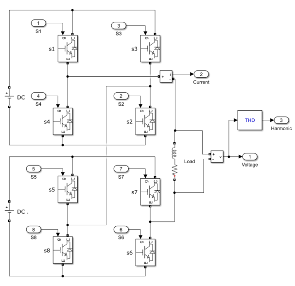

---

## Modulating Signal

> Insert the sine wave modulating signal.

```text
images/sine-wave.png
```

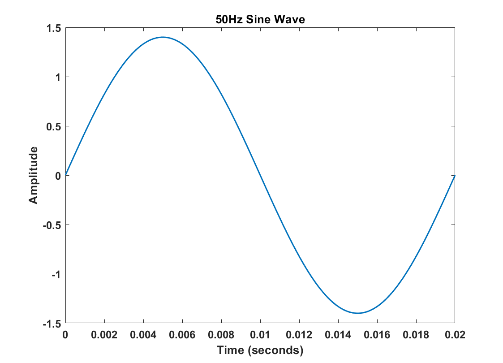

---

## Triangular Carrier Signal

> Insert the triangular carrier waveform.

```text
images/triangular-wave.png
```

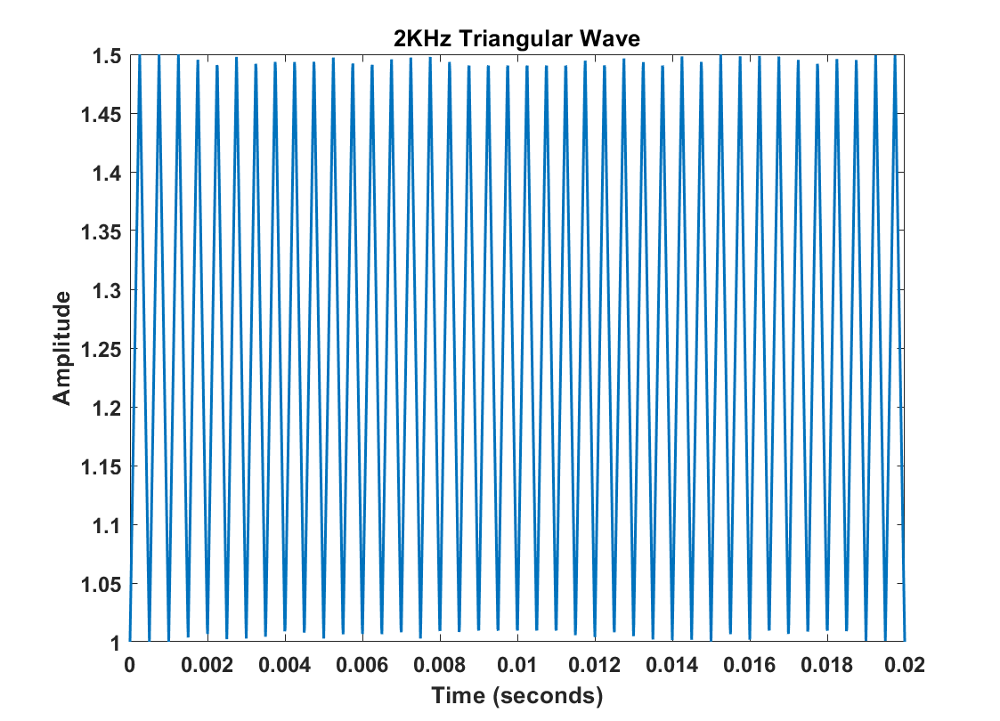

---

## Signal Comparison

| S1 – S4                          | S5 – S8                          |
| -------------------------------- | -------------------------------- |
| 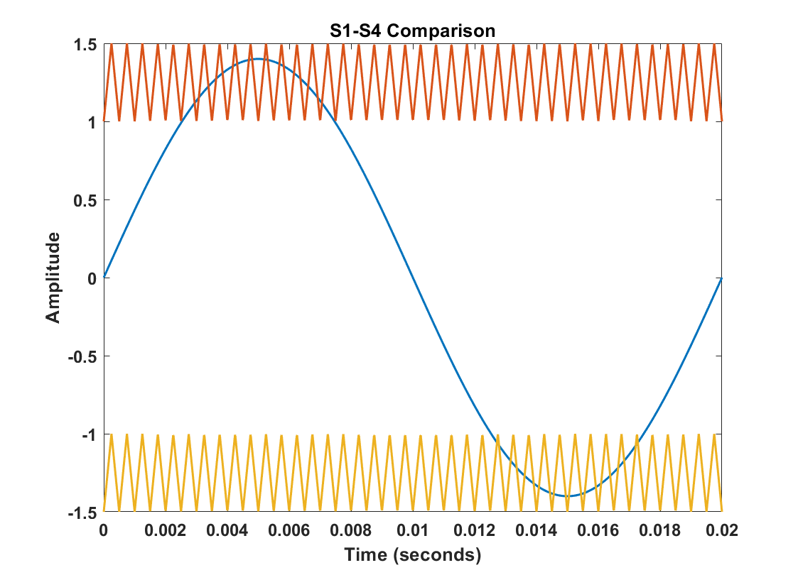 | 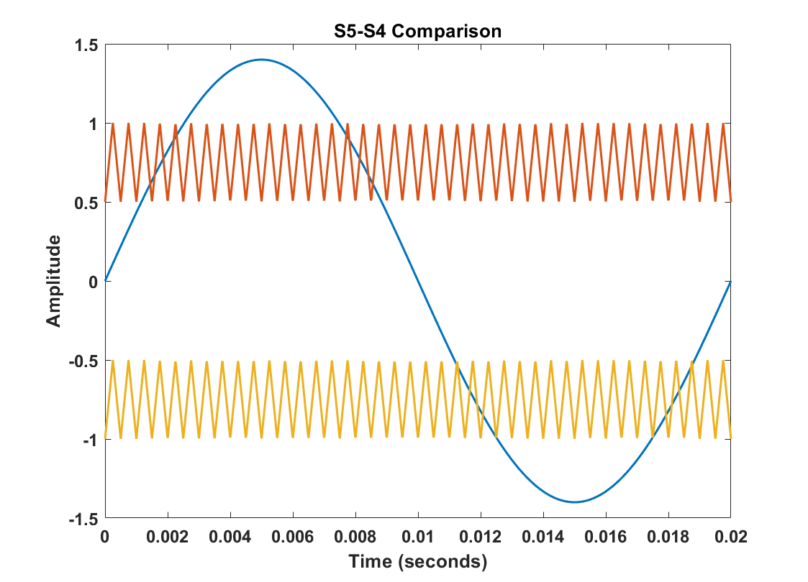 |

---

## Overall Signal Modulation

> Insert the overall modulation waveform.

```text
images/overall-modulation.png
```

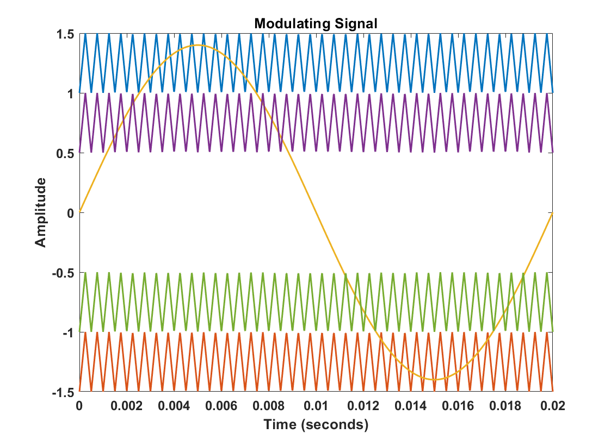

---

# Simulation Results

## Resistive (R) Load

| Output Voltage                 | Output Current                 |
| ------------------------------ | ------------------------------ |
| 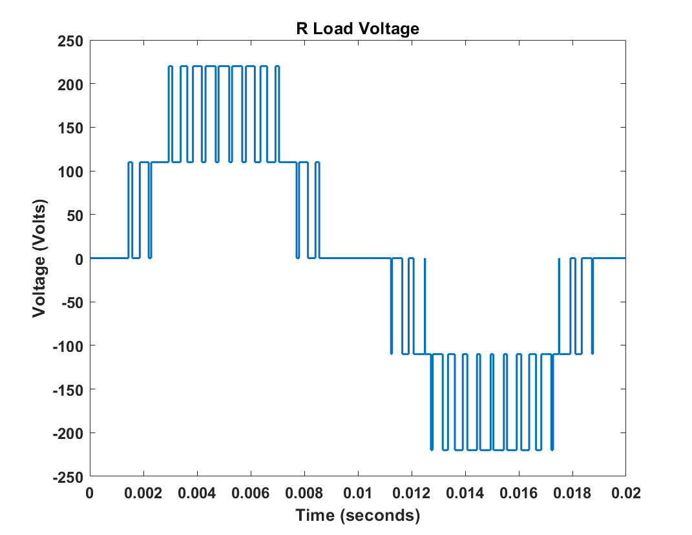 | 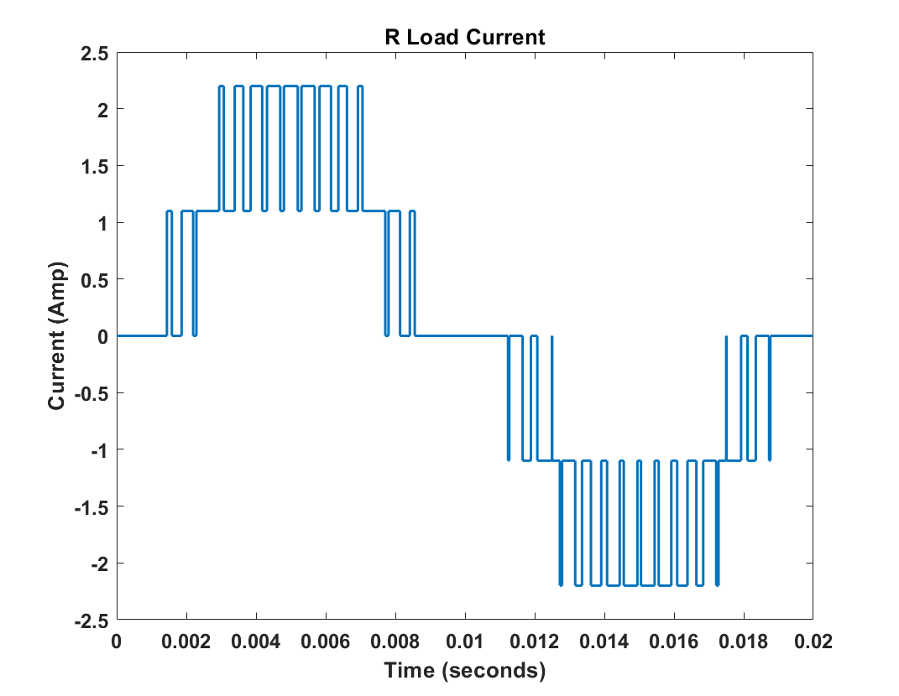 |

---

## Inductive (L) Load

| Output Voltage                 | Output Current                 |
| ------------------------------ | ------------------------------ |
| 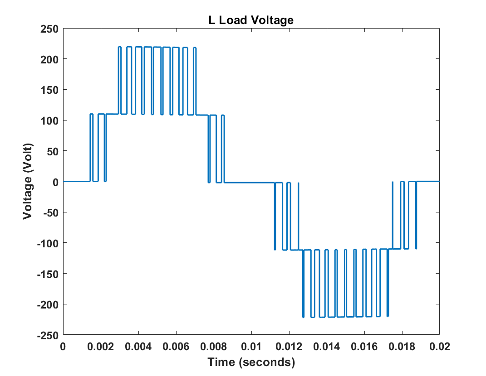 | 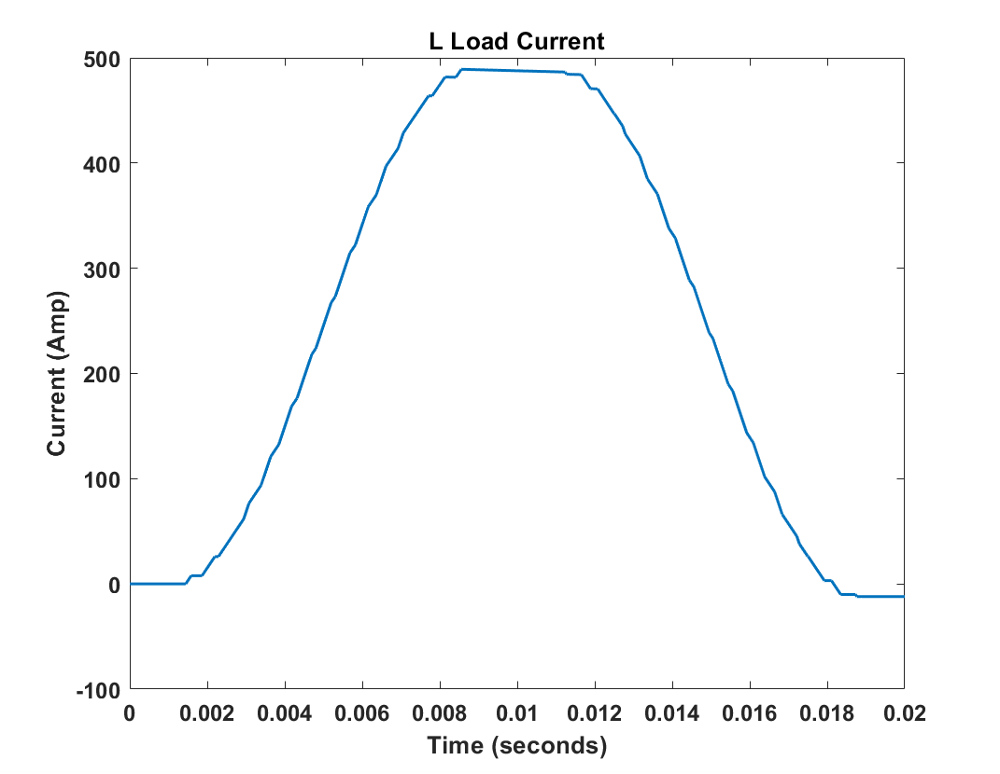 |

---

## Resistive-Inductive (RL) Load

| Output Voltage                  | Output Current                  |
| ------------------------------- | ------------------------------- |
|  | 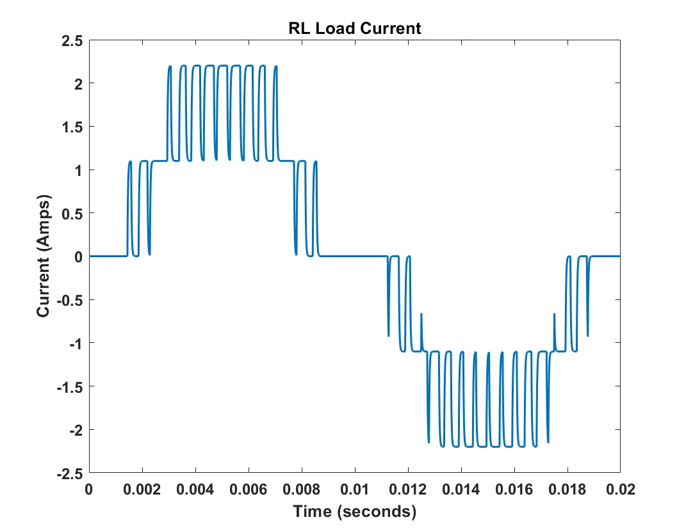 |

---

## Resistive-Inductive-Capacitive (RLC) Load

| Output Voltage                   | Output Current                   |
| -------------------------------- | -------------------------------- |
| 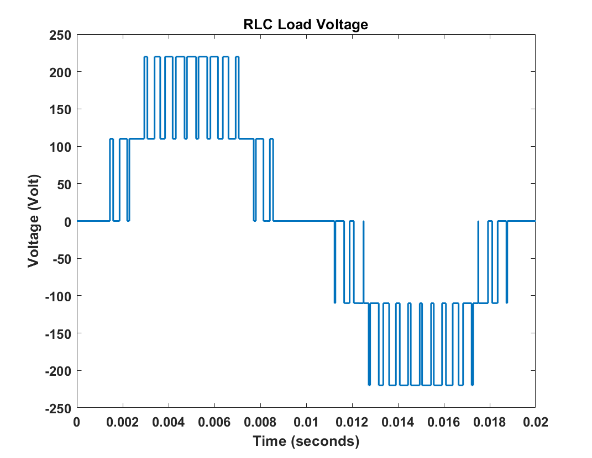 | 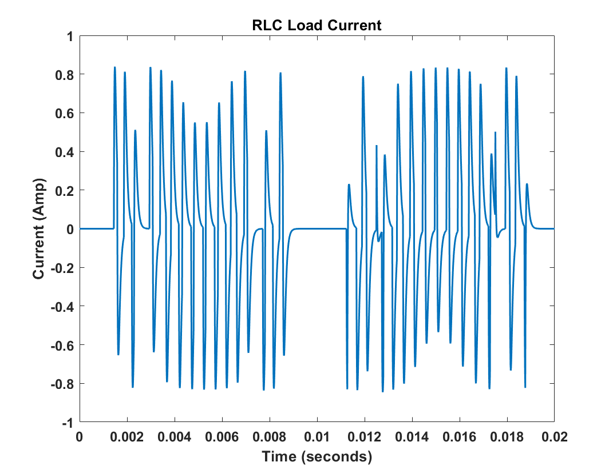 |

---

# Results Summary

The simulation demonstrates:

* Generation of SPWM switching pulses
* Five-level inverter output voltage
* Output current characteristics under different load conditions
* Operation of the cascaded H-bridge inverter using two separate DC sources

---

# Software Requirements

* MATLAB
* Simulink
